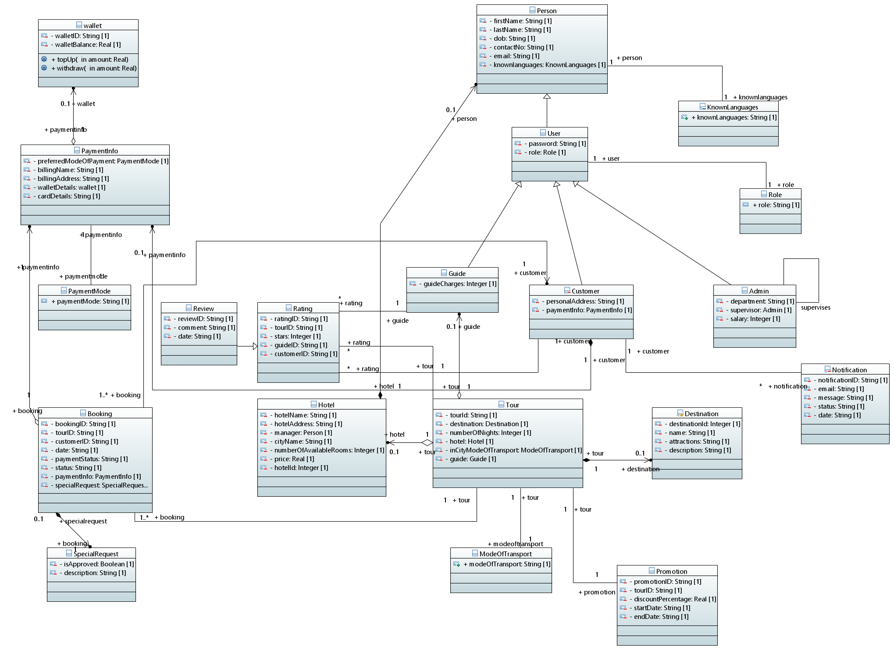

# COEN-6312-GROUP-4
## Group 4 Project COEN 6312

### DESCRIPTION
TourEasy is a complete Tour Booking System developed to simplify and improve the tour management process for end users. It caters to the needs of four major stakeholders: customers, tour operators, guides, and administrators.

The system offers a user-friendly platform for efficient planning, booking, and coordination of tours. It includes intuitive customer profiles for personalized experiences and guide matching for optimal tour guide assignments.

The system also provides features like detailed destination Information, an effective rating and review system, secure payment processing, and management tools. The system ensures seamless collaboration between all stakeholders, from vehicle and transportation management to the availability of guide schedules. It also allows users to take advantage of the discounts (If any) for the tour they select. Our system aims to provide updates to potential users about their interaction with the system. 

The system strives to deliver prompt responses to user inputs, ensuring a seamless and efficient experience, while maintaining consistent accessibility and minimizing downtime or disruptions. It can easily adapt and expand, to accommodate a growing number of users and tours. This allows the system to meet the changing requirements of the users. Customers can save time and experience the platform's effectiveness by accessing quick solutions for common issues through the FAQ area, rather than reaching out to support directly.

Through this project we aim to revolutionize the tour industry, delivering a smooth and enjoyable experience to our end users that prioritizes transparency, convenience, and customer satisfaction.

### Class Diagram

### RUN COMPILED JAR
1. Download .jar file from pre-release
2. Run jar file with `java -jar ./toureasy.jar`
